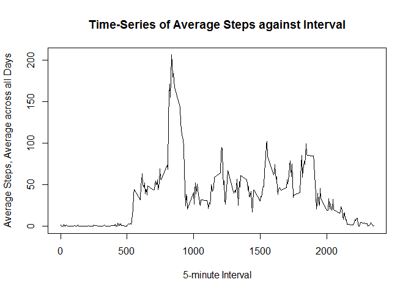

# Reproducible Research: Peer Assessment 1

It is now possible to collect a large amount of data about personal movement using activity monitoring devices such as a Fitbit, Nike Fuelband, or Jawbone Up. These type of devices are part of the "quantified self" movement - a group of enthusiasts who take measurements about themselves regularly to improve their health, to find patterns in their behavior, or because they are tech geeks. But these data remain under-utilized both because the raw data are hard to obtain and there is a lack of statistical methods and software for processing and interpreting the data.

This assignment makes use of data from a personal activity monitoring device. This device collects data at 5 minute intervals through out the day. The data consists of two months of data from an anonymous individual collected during the months of October and November, 2012 and include the number of steps taken in 5 minute intervals each day.

## Loading and preprocessing the data

```r
df <- read.csv("activity.csv")
df$date <- as.Date(df$date, format = "%Y-%m-%d")
```

## What is mean total number of steps taken per day?

This is a histogram of the total number of steps taken each day.

```r
#---------Summarize-------------------------------------
df.byday <- aggregate(df[, 'steps'], by=list(df$date), FUN=sum, na.rm=TRUE)
names(df.byday) <- c('date','steps')
hist(df.byday$steps, xlab='Steps', main = 'Histogram of total steps')

df.byday.mean <- toString(round(mean(df.byday$steps, na.rm=TRUE)))
df.byday.median <- toString(round(median(df.byday$steps, na.rm=TRUE)))        

abline(v = df.byday.mean, col = "green", lwd = 4)
abline(v = df.byday.median, col = "blue", lwd = 4)

legend("topright", legend = c(paste("Mean is", df.byday.mean), 
    paste("Median is ", df.byday.median)), col = c("green", "blue"), 
    lty = 1)
```

 

**The average (mean) number of steps taken each day is `` 9354 `` and the median number of steps taken each day is `` 10395 ``.**               


## What is the average daily activity pattern?
This is a time series plot of the 5-minute interval (x-axis) and the average number of steps taken, averaged across all days (y-axis).
 

```r
#-------------------------Time series---------

df.byinterval <-  aggregate(df[, 'steps'], by=list(df$interval), FUN=mean, na.rm=TRUE)
names(df.byinterval) <- c('interval','steps')

with(df.byinterval, {
        plot(
                x=interval,
                y=steps,
                type="l",
                main="Time-Series of Average Steps against Interval",
                xlab="5-minute Interval",
                ylab="Average Steps, Average across all Days"
                
        )
})
```

 

```r
df.byinterval.max.steps <- toString(df.byinterval[which(df.byinterval$steps == max(df.byinterval$steps)),]$interval)
```

**The interval that contains the maximum number of steps on average across all the days in the dataset is `` 835 `` **


## Imputing missing values

Calculating and reporting the total number of missing values in the dataset (i.e. the total number of rows with NAs)

```r
na.values.count <- nrow(subset(df, is.na(df$steps) == TRUE))
```
**The total number of missing values in the dataset (i.e. the total number of rows with NAs) is `` 2304 `` **
 

Creating a new dataset that is equal to the original dataset but with the missing data filled in. Making a histogram of the total number of steps taken each day. Reporting the **mean** and **median** total number of steps taken per day.


```r
df.adj <- df
df.adj$steps[is.na(df.adj$steps)] <- ave(df.adj$steps, 
                                         df.adj$interval, 
                                         FUN=function(x) 
                                                 round(mean(x, na.rm = T)))[is.na(df.adj$steps)] 

df.adj.byday <- aggregate(df.adj[, 'steps'], by=list(df.adj$date), FUN=sum)
names(df.adj.byday) <- c('date','steps')
hist(df.adj.byday$steps, xlab='Steps', main = 'Histogram of total steps')

df.adj.byday.mean <- toString(round(mean(df.adj.byday$steps, , na.rm=TRUE)))
df.adj.byday.median <- toString(round(median(df.adj.byday$steps, na.rm=TRUE)))

abline(v = df.adj.byday.mean, col = "green", lwd = 4)
abline(v = df.adj.byday.median, col = "blue", lwd = 4)

legend("topright", legend = c(paste("Mean is", df.adj.byday.mean), 
                              paste("Median is ", df.adj.byday.median)), col = c("green", "blue"), 
       lty = 1)
```

 

**While the median value has stayed the same, the mean value got higher after adding missing data back. **

**The average (mean) number of steps taken each day is `` 10766 `` and the median number of steps taken each day is `` 10762 ``.**     


## Are there differences in activity patterns between weekdays and weekends?

```r
#1. Declare a function
my.weekend.function <- function(dte){
        if (weekdays(dte) == 'Saturday' || weekdays(dte) == 'Sunday'){
                result <- 'weekend'
        }
        else{
                result <- 'weekday'        
        }
        
        return(result)
}
```


```r
#2. Add a new column
df$date_type <- sapply(df[,2], my.weekend.function)
df$date_type <-as.factor(df$date_type)

df.byinterval.bydatetype <-  aggregate(df[, 'steps'], by=list(df$interval, df$date_type), FUN=mean, na.rm=TRUE)
names(df.byinterval.bydatetype) <- c('interval','date_type', 'steps')

#3. Build a chart to review result and discuss differencies
library("lattice")

xyplot(
        type="l",
        data=df.byinterval.bydatetype,
        steps ~ interval | date_type,
        xlab="Interval",
        ylab="Number of steps",
        layout=c(1,2)
)
```

 

It looks like a person overall performes more steps during weekends. The person starts and ends their day later diring wekends also. 

